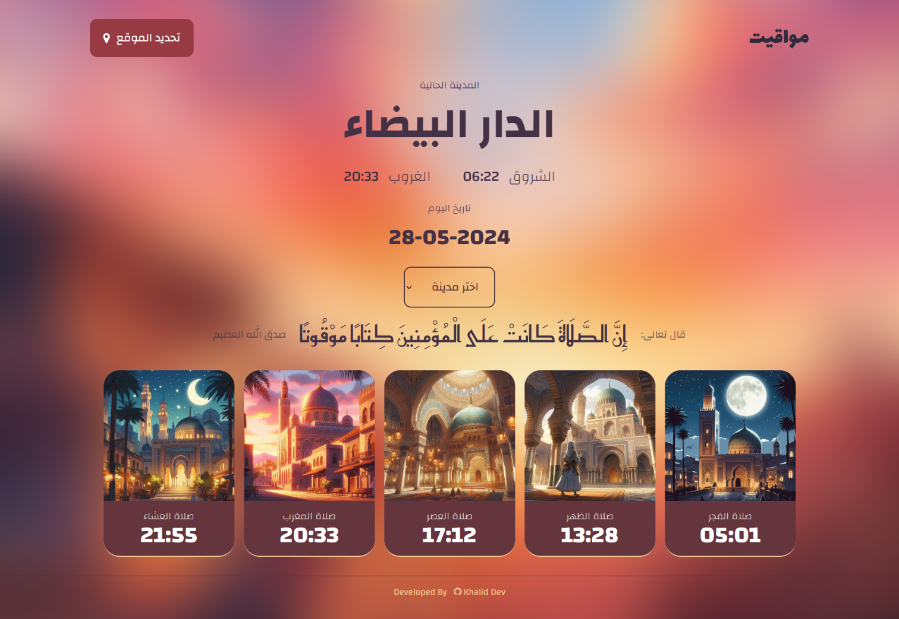

## Mawaqit: Islamic Prayer Times

### Screenshot

This project, Mawaqit, is a web application designed to display Islamic prayer times in a clear and visually appealing way. It utilizes the following technologies:

- **HTML:** Provides the structure for the webpage.
- **CSS:** Styles the webpage for a user-friendly and informative display.
- **JavaScript:** Uses Axios library to fetch prayer times data from an API.
- **API:** (**[Adhan API](https://aladhan.com/prayer-times-api)** - Fetches prayer times data for a specific location.

### Links

- Live Site URL: [Mawaqit](https://github.com/5alidev)

### Features

- Fetches prayer times for a specified location.
- Displays prayer names and corresponding times in a clear and user-friendly format.
- (Optional) Allows users to change the location to view prayer times for a different area.

### Continued Development

- Integrate notifications for upcoming prayer times.
- Add options for displaying prayer times in different formats (e.g., 12-hour clock, Hijri calendar).
- Enhance the visual design and user experience.

### Contributing

We welcome contributions to this project! Feel free to fork the repository, make changes, and submit a pull request.

### Author

- Twitter - [@Khalid\_\_Dev](https://www.twitter.com/Khalid__Dev)
